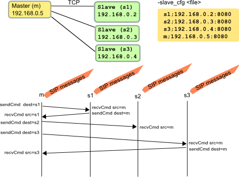

3PCC Extended
=============

An extension of the 3pcc mode is implemented in SIPp. This feature
allows any number of SIPp instances to communicate with each other,
each one of them being connected to a remote host.

The SIPp instance which initiates the call is launched in "master"
mode. The others are launched in "slave" mode. Slave SIPp instances
have names, given in the command line (for example, s1, s2...sN for
the slaves and m for the master) Correspondances between instances
names and their addresses must be stored in a file (provided by
``-slave_cfg`` command line argument), in the following format::

    s1;127.0.0.1:8080
    s2;127.0.0.1:7080
    m;127.0.0.1:6080

Each SIPp instance must access a different copy of this file.

sendCmd and recvCmd have additional attributes::

    <sendCmd dest="s1">
      <![CDATA[
        Call-ID: [call_id]
        From: m
        [$1]

      ]]>
    </sendCmd>

Will send a command to the "s1" peer instance, which can be either
master or slave, depending on the command line argument, which must be
consistent with the scenario: a slave instance cannot have a sendCmd
action before having any recvCmd. Note that the message must contain a
"From" field, filled with the name of the sender.

::

    <recvCmd src="m">
      <action>
         <ereg regexp="Content-Type:.*"
               search_in="msg"
               assign_to="2"/>
      </action>
    </recvCmd>

Indicates that the twin command is expected to be received from the
"m" peer instance.

Note that the master must be the launched at last.

There is no integrated scenarios for the 3pcc extended mode, but you
can easily adapt those from 3pcc.

**Example:** the following drawing illustrate the entire procedure.
The arrows that are shown between SIPp master and slaves depict only
the synchronization commands exchanged between the different SIPp
instances. The SIP message exchange takes place as usual.

