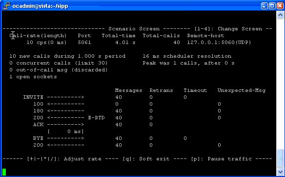

Foreword
~~~~~~~~

Warning
This version of the documentation is for SIPp |version| and describes some
features not present in earlier versions. See the sidebar to access
documentation for previous versions.
SIPp is a performance testing tool for the SIP protocol. It includes a
few basic SipStone user agent scenarios (UAC and UAS) and establishes
and releases multiple calls with the INVITE and BYE methods. It can
also reads XML scenario files describing any performance testing
configuration. It features the dynamic display of statistics about
running tests (call rate, round trip delay, and message statistics),
periodic CSV statistics dumps, TCP and UDP over multiple sockets or
multiplexed with retransmission management, regular expressions and
variables in scenario files, and dynamically adjustable call rates.

SIPp can be used to test many real SIP equipements like SIP proxies,
B2BUAs, SIP media servers, SIP/x gateways, and SIP PBXes. It is also
very useful to emulate thousands of user agents calling your SIP
system.

Want to see it?

Here is a screenshot

