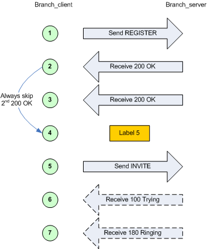

.. _cond-branching:

Conditional branching
`````````````````````


Conditional branching in scenarios
++++++++++++++++++++++++++++++++++

It is possible to execute a scenario in a non-linear way. You can jump
from one part of the scenario to another for example when a message is
received or if a call variable is set.

You define a label (in the xml) as <label id="n"/> Where n is a number
between 1 and 19 (we can easily have more if needed). The label
commands go anywhere in the main scenario between other commands. To
any action command (send, receive, pause, etc.) you add a next="n"
parameter, where n matches the id of a label. When it has done the
command it continues the scenario from that label. This part is useful
with optional receives like 403 messages, because it allows you to go
to a different bit of script to reply to it and then rejoin at the BYE
(or wherever or not).

Alternatively, if you add a test="m" parameter to the next, it goes to
the label only if variable [$m] is set. This allows you to look for
some string in a received packet and alter the flow either on that or
a later part of the script. The evaluation of a test varies based on
the type of call variable. For regular expressions, at least one match
must have been found; for boolean variables the value must be true;
and for all others a value must have been set (currently this only
applies to doubles). For more complicated tests, see the <test>
action.

.. warning::
    If you add special cases at the end, dont forget to put a label at the
    real end and jump to it at the end of the normal flow.

Example:

The following example corresponds to the embedded 'branchc' (client
side) scenario. It has to run against the embedded 'branchs' (server
side) scenario.


.. image:: branching_02.gif


Randomness in conditional branching
+++++++++++++++++++++++++++++++++++

To have SIPp behave somewhat more like a "normal" SIP client being
used by a human, it is possible to use "statistical branching".
Wherever you can have a conditional branch on a variable being set
(test="4"), you can also branch based on a statistical decision using
the attribute "chance" (e.g. chance="0.90"). Chance can have a value
between 0 (never) and 1 (always). "test" and "chance" can be combined,
i.e. only branching when the test succeeds and the chance is good.

With this, you can have a variable reaction in a given scenario (e.g..
answer the call or reject with busy), or run around in a loop (e.g.
registrations) and break out of it after some random number of
iterations.
