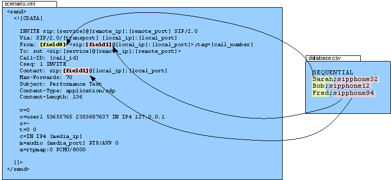

Injecting values from an external CSV during calls
``````````````````````````````````````````````````

You can use "-inf file_name" as a command line parameter to input
values into the scenarios. The first line of the file should say
whether the data is to be read in sequence (SEQUENTIAL), random order
(RANDOM), or in a user based manner (USER). Each line corresponds to
one call and has one or more ';' delimited data fields and they can be
referred as [field0], [field1], ... in the xml scenario file. Example::

    SEQUENTIAL
    #This line will be ignored
    Sarah;sipphone32
    Bob;sipphone12
    #This line too
    Fred;sipphone94


Will be read in sequence (first call will use first line, second call
second line). At any place where the keyword "[field0]" appears in the
scenario file, it will be replaced by either "Sarah", "Bob" or "Fred"
depending on the call. At any place where the keyword "[field1]"
appears in the scenario file, it will be replaced by either
"sipphone32" or "sipphone12" or "sipphone94" depending on the call. At
the end of the file, SIPp will re-start from the beginning. The file
is not limited in size.

You can override the default line selection strategy with the optional
line argument. For example::

    [field0 line=1]


Selects the second line in the file (the first line is line zero. The
line parameters support keywords in the argument, so in conjunction
with a lookup action it is possible to select values based on a key.

The CSV file can contain comment lines. A comment line is a line that
starts with a "#".

As a picture says more than 1000 words, here is one:



Think of the possibilities of this feature. They are huge.

It is possible to use more than one injection file, and is necessary
when you want to select different types of data in different ways. For
example, when running a user-based benchmark, you may have a
caller.csv with "USER" as the first line and a callee.csv with
"RANDOM" as the first line. To specify which CSV file is used, add the
file= parameter to the keyword. For example::

    INVITE sip:[field0 file="callee.csv"] SIP/2.0
    From: sipp user <[field0 file="caller.csv"]>;tag=[pid]SIPpTag00[call_number]
    To: sut user <[field0 file="callee.csv"]>
    ...


Will select the destination user from callee.csv and the sending user
from caller.csv. If no file parameter is specified, then the first
input file on the command line is used by default.


PRINTF Injection files
++++++++++++++++++++++

An extension of the standard injection file is a "PRINTF" injection
file. Often, an input file will has a repetitive nature such as::

    USERS
    user000;password000
    user001;password001
    ...
    user999;password999


SIPp must maintain this structure in memory, which can reduce
performance for very large injection files. To eliminate this problem,
SIPp can automatically generate such a structured file based on one or
more template lines. For example::

    USERS,PRINTF=999
    user%03d;password%03d


Has the same logical meaning as the original example, yet SIPp only
needs to store one entry in memory. Each time a line is used; SIPp
will replace %d with the requested line number (starting from zero).
Standard printf format decimal specifiers can be used. When more than
one template line is available, SIPp cycles through them. This
example::

    USERS,PRINTF=4
    user%03d;password%03d;Foo
    user%03d;password%03d;Bar


Is equivalent to the following injection file::

    USERS
    user000;password000;Foo
    user001;password001;Bar
    user002;password002;Foo
    user003;password003;Bar


The following parameters are used to control the behavior of printf
injection files:


Printf Injection File Parameters
````````````````````````````````
Parameter Description Example PRINTF How many virtual lines exist in
this file. PRINTF=10, creates 10 virtual lines PRINTFMULTIPLE Multiple
the virtual line number by this value before generating the
substitutions used. PRINTF=10,PRINTFMULTIPLE=2 creates 10 virtual
lines numbered 0,2,4,...,18. PRINTFOFFSET Add this value to the
virtual line number before generating the substitutions used (applied
after PRINTFMULTIPLE). PRINTF=10,PRINTFOFFSET=100 creates 10 virtual
lines numbered 100-109. PRINTF=10,PRINTFMULTIPLE=2,PRINTFOFFSET=10
creates 10 users numbered 10,12,14,...28.


Indexing Injection files
++++++++++++++++++++++++

The -infindex option allows you to generate an index of an injection
file. The arguments to -infindex are the injection file to index and
the field number that should be indexed. For example if you have an
injection file that contains user names and passwords (as the
following)::

    USERS
    alice,pass_A
    bob,pass_B
    carol,pass_C


You may want to extract the password for a given user in the file. To do this
efficiently, SIPp must build an index for the first field (0).  Thus you would
pass the argument ``-infindex users.csv 0`` (assuming the file basename is
``users.csv``). SIPp will create an index that contains the logical entries
``{"alice" => 0, "bob" => 1, "carol" => 2}``. To extract a particular password,
you can use the lookup action to store the line number into a variable (say
``$line``) and then use the keyword ``[field1 line="[$line]"]``.
