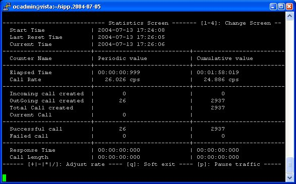

Main features
=============

SIPp allows to generate one or many SIP calls to one remote system.
The tool is started from the command line. In this example, two SIPp
are started in front of each other to demonstrate SIPp capabilities.

Run sipp with embedded server (uas) scenario::

    # ./sipp -sn uas

On the same host, run sipp with embedded client (uac) scenario::

    # ./sipp -sn uac 127.0.0.1


Running SIPp in background
``````````````````````````

SIPp can be launched in background mode (-bg command line option).

By doing so, SIPp will be detached from the current terminal and run
in the background. The PID of the SIPp process is provided. If you
didn't specify a number of calls to execute with the -m option, SIPp
will run forever.

There is a mechanism implemented to stop SIPp smoothly. The command
kill -SIGUSR1 [SIPp_PID] will instruct SIPp to stop placing any new
calls and finish all ongoing calls before exiting.

When using the background mode, the main sipp instance stops and a
child process will continue the job. Therefore, the log files names
will contain another PID than the actual sipp instance PID.


Screens
```````

Several screens are available to monitor SIP traffic. You can change
the screen view by pressing 1 to 9 keys on the keyboard.


+ Key '1': Scenario screen. It displays a call flow of the scenario as
  well as some important informations.


+ Key '2': Statistics screen. It displays the main statistics
  counters. The "Cumulative" column gather all statistics, since SIPp
  has been launched. The "Periodic" column gives the statistic value for
  the period considered (specified by -f frequency command line
  parameter).



+ Key '3': Repartition screen. It displays the distribution of
  response time and call length, as specified in the scenario.


+ Key '4': Variables screen. It displays informations on actions in
  scenario as well as scenario variable informations.


Exit codes
``````````

To ease automation of testing, upon exit (on fatal error or when the
number of asked calls (-m command line option) is reached, sipp exits
with one of the following exit codes:

====  ===========
Code  Description
====  ===========
0     All calls were successful
1     At least one call failed
97    Exit on internal command. Calls may have been processed. Also
      exit on global timeout (see -timeout_global option)
99    Normal exit without calls processed
-1    Fatal error
-2    Fatal error binding a socket
====  ===========

Depending on the system that SIPp is running on, you can echo this
exit code by using "echo ?" command.


Contributing to SIPp
````````````````````

Of course, we welcome contributions, and many of SIPp's features
(including epoll support for better Linux performance, RTP streaming,
and Cygwin support) have come from external contributions.

See `developers guide`_ for how to get started

+ Richard GAYRAUD [initial code]
+ Olivier JACQUES [code/documentation]
+ Robert Day [code/documentation]
+ Charles P. Wright [code]
+ Many contributors [code]


.. _developers guide: https://github.com/SIPp/sipp/wiki/New-Developers'-Guide
